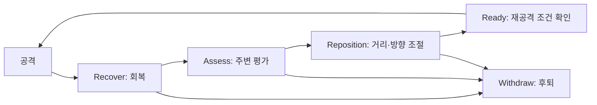

# 동물 AI와 사람과의 교감

[문서 처음](../README.md) · [전체 구조](architecture.md) · [검증 범위](development-and-validation.md)

기준일: 2026-10-01. 아래는 현재 소스와 날짜별 개발 기록을 확인해 정리한 내용입니다.

## 감각과 욕구를 읽는 행동 결정

`ANNAnimalController`는 종별 시야·청각 범위를 AI Perception에 적용하고 관측을 `ANNAnimal::Observe`와 `HearNoise`에 전달합니다. `Think`는 현재 행동과 위협·명령·욕구를 고려해 탐색·도주·섭식·음수·휴식·전투를 정합니다.

종별 설정은 `UNNAnimalData`와 `Config/NNAnimalSpeciesRules.json`에 둡니다. 같은 행동 코드에서도 감각 범위, 식단, 전투 성향과 허용 명령을 다르게 조정합니다. 현재 동물 AI는 C++ 우선순위와 명시적 상태 전이를 사용합니다.

## 공격 후 판단

공격 후에는 회복, 주변 평가, 거리·방향 조절을 거쳐 다시 행동 조건을 검사합니다. 체력·피로·위험과 종별 성향에 따라 후퇴할 수도 있습니다.

근거는 `NNAnimalCombat.cpp`의 `FNNAnimalCombatMemory::Started`, `Advance`와 `FNNAnimalEncounterMemory::Response`입니다. 실제 이동은 `NNAnimalCombatLive.cpp`에서 연결합니다.

전투 성향은 `Never`, `Defensive`, `Predator`로 구분합니다. 토끼와 뿔 없는 사슴 변형은 비공격 규칙을 적용하고 일부 큰 초식동물은 위협에 대응합니다. 이 값은 게임 규칙입니다. 종별 사회 행동과 무리 보호, 장기간 균형은 계속 검수합니다.

## 경험 기억과 망각

피격 대상, 위치, 위험도와 시각을 기록합니다. `FNNAnimalExperience::Learn`은 위험도를 0~1 범위에서 축적하며 위협 기억을 최대 8개 유지합니다. `Decay`의 반감 기준은 게임 시간 1,800초이고 `RiskAt`은 대상과 거리를 반영합니다. 이 값을 회피·전투·배회 판단에 사용합니다.

이는 규칙 기반 경험 기억입니다. 신경망 학습이나 강화학습 정책 훈련을 사용하지 않습니다. 근거는 `NNWildlifeTypes.cpp`의 `Learn`, `Decay`, `RiskAt`과 `NNAnimal.cpp`의 `RememberDamage`, `Think`입니다.

## 생명별 관계와 명령

관계는 PlayerId와 LifeId를 함께 기록합니다. 같은 플레이어가 새 생명으로 시작하면 관계를 새로 시작하는 규칙을 둡니다. 안전한 반복 만남, 먹이 주기, 쓰다듬기와 훈련 경험을 기록하고 명령 조건에 반영합니다.

| 역할 | 원본 파일·함수 |
|---|---|
| 반복 만남과 생명별 관계 | `NNAnimalBond.cpp` · `Observe`, `Visit`, `GetOrAdd`, `Find`, `Forget` |
| 돌봄과 훈련 경험 | `NNAnimalBond.cpp` · `CanCare`, `CompleteCare`, `RecordTraining` |
| 교감 예약과 취소 | `NNAnimalCare.cpp` · `ReserveCare` |
| 명령 실행 | `NNAnimalCommands.cpp` · `CanCommand`, `IssueCommand`, `UpdateCommand` |
| 보호와 사냥 귀환 | `NNAnimalDefense.cpp` · `UpdateDefense`, `NNAnimalHunt.cpp` · `UpdateHunt`, `ReturnFromHunt` |

9월 말 검수에서는 여러 종의 먹이 주기·쓰다듬기를 확인했습니다. 신뢰와 먹이를 준비한 환경에서 진행한 검수입니다. 늑대·돼지·여우·암사슴의 따라오기·기다리기도 실제 게임에서 관찰했습니다. 전 종의 야생 첫 만남부터 경비·보호·사냥·사육까지 이어지는 플레이는 아직 검수 중입니다.

## 야행성 행동과 개체군 회복

웨어울프에는 낮의 굴 복귀, 밤의 감각 강화와 플레이어 추적, 공격한 상대의 기억, 사냥 쿨다운을 추가했습니다. 2026-09-30 기록에서 낮의 휴식과 밤의 추격·공격을 실제 게임으로 확인했습니다. 휴면 중 상대 기억은 기존 `Experience`의 위협 기억을 활용합니다. 굴의 내부 형태와 서식 동선은 월드 작업에서 별도로 다듬고 있습니다.

원거리 생태에는 상한 사체가 일정 시간이 지나면 같은 종의 새 개체로 홈에 돌아오는 회복 규칙을 추가했습니다. 관계·명령·경험은 초기화합니다. 장기적인 포식·번식 균형과 종별 번식 시기·무리 상한은 후속 검수 대상입니다.

## 먹이를 받는 중 회전하던 문제

실제 섬에서 돼지가 교감을 받아들인 뒤에도 이전 회전을 계속해 손과 입이 닿지 않는 문제를 확인했습니다. `ReserveCare`에서 이동 입력과 진행 중 회전을 함께 정리한 뒤 같은 조건으로 다시 검사했습니다. 접근이 부족하면 먹이를 소비하지 않고 취소하며 충분히 가까이 다가간 뒤에만 성공합니다.

2026-09-20에는 자연 배치 돼지·멧돼지의 반복 만남, 채집한 사과 수령, 새 프로세스의 관계·수량 복원을 확인했습니다. 준비 조건과 미확인 범위는 [검증 문서](development-and-validation.md)에 기록했습니다.

본문의 파일은 비공개 원본 프로젝트의 `Source/NONGJANG/` 아래에 있습니다.
