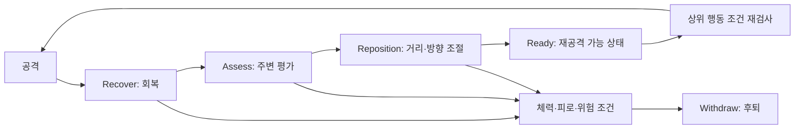

# 동물 AI와 사람과의 교감

[문서 처음](../README.md) · [전체 구조](architecture.md) · [검증 범위](development-and-validation.md)

## 감각과 욕구를 함께 읽는 행동 결정

`ANNAnimalController`가 종별 시야·청각 범위를 AI Perception에 적용하고, 관측 이벤트를 `ANNAnimal::Observe`와 `HearNoise`에 전달합니다. `ANNAnimal::Think`는 현재 실행 중인 행동, 위협·명령·욕구를 고려해 다음 행동을 결정합니다. 탐색·도주·섭식·음수·휴식·전투 등이 이동 요청과 함께 연결됩니다.

근거 파일은 `Source/NONGJANG/NNAnimalController.cpp`, `NNAnimal.cpp`, `NNAnimal.h`입니다. 종별 조정은 `UNNAnimalData`와 `Config/NNAnimalSpeciesRules.json`에 분리합니다. 데이터를 바꾸면 같은 행동 코드에서 감각 범위·식단·전투 성향·명령 허용을 다르게 설정할 수 있습니다.

이 구조는 C++ 우선순위와 명시적 상태 전이를 사용합니다. 행동 트리 에셋의 존재만으로 해당 동물 AI가 Behavior Tree를 사용한다고 설명하지 않습니다.

## 공격 이후에도 판단하는 전투 단계

공격 가능 시간이 지났다는 이유만으로 같은 공격을 계속 반복하지 않도록 전투 중간 단계를 분리했습니다. 체력·피로·위험도와 종별 성향이 관찰 시간 및 후퇴 판단에 반영됩니다.

근거는 `Source/NONGJANG/NNAnimalCombat.cpp`의 `FNNAnimalCombatMemory::Started`, `Advance`와 `FNNAnimalEncounterMemory::Response`, 실제 이동 연결은 `NNAnimalCombatLive.cpp`입니다.

전투 성향은 `Never`, `Defensive`, `Predator`로 구분합니다. 게임 내 토끼와 뿔 없는 사슴 변형은 비공격 규칙을 적용하고, 일부 큰 초식동물은 위협 상황의 방어를 허용합니다. 이 값은 게임 설계이며 실제 동물의 모든 행동을 재현한 생물학적 모델은 아닙니다. 종별 사회 행동·놀이·무리 보호와 장기간 생태 균형은 확장 중입니다.

## 제한된 기억과 망각

피격 경험은 대상, 위치, 위험도, 관측 시각으로 기록합니다. `FNNAnimalExperience::Learn`은 위험도를 0~1 범위에서 축적하며 최대 8개 위협 기억을 유지합니다. `Decay`는 시간에 따른 반감식을 적용하고, `RiskAt`은 대상 일치와 공간 거리를 반영합니다.

현재 감쇠 규칙의 반감 기준은 게임 시간 1,800초입니다. 위험은 고정된 감정이나 생물학적 실측값이 아니라 조정 가능한 게임 값입니다. `ANNAnimal`은 위협 반응과 이동 후보의 위험을 조회해 판단에 반영합니다.

근거는 `Source/NONGJANG/NNWildlifeTypes.cpp`의 `Learn`, `Decay`, `RiskAt` 및 `NNAnimal.cpp`의 `RememberDamage`, `Think`입니다. 신경망을 학습하거나 강화학습 정책을 훈련하는 구조가 아닙니다.

## 플레이어의 생명에 연결한 관계와 명령

관계는 PlayerId와 LifeId를 함께 기록합니다. 같은 플레이어라도 새 생명으로 시작하면 해당 관계를 새로 시작하는 규칙을 둡니다. 안전한 반복 만남, 먹이 주기, 쓰다듬기, 대기·동행·경비·보호·사냥 명령 경험은 각각 기록합니다.

| 역할 | 원본 파일·함수 |
|---|---|
| 관찰과 반복 만남 | `NNAnimalBond.cpp` · `FNNAnimalVisitObservation::Observe`, `FNNAnimalBonds::Visit` |
| 생명별 관계 | `NNAnimalBond.cpp` · `GetOrAdd`, `Find`, `Forget` |
| 돌봄과 경험 | `NNAnimalBond.cpp` · `CanCare`, `CompleteCare`, `RecordTraining` |
| 교감 예약·취소 | `NNAnimalCare.cpp` · `ReserveCare` |
| 명령 조건과 실행 | `NNAnimalCommands.cpp` · `CanCommand`, `IssueCommand`, `UpdateCommand` |
| 보호·사냥 귀환 | `NNAnimalDefense.cpp` · `UpdateDefense`, `NNAnimalHunt.cpp` · `UpdateHunt`, `ReturnFromHunt` |

위 파일은 모두 원본 프로젝트의 `Source/NONGJANG/` 아래에 있습니다. 일부 종의 교감과 늑대 명령을 연결했으며, 모든 종의 첫 만남부터 사육·훈련까지 완성된 상태는 아닙니다.

## 실제 문제 해결: 먹이를 받는 중 계속 회전하던 동물

실제 섬에서 돼지가 교감을 받아들인 뒤에도 이전 회전을 계속해 손과 입의 접촉을 놓치는 문제를 확인했습니다. 이동 중단만으로는 진행 중인 방향 전환이 취소되지 않았습니다.

`ReserveCare`에서 이동 입력과 진행 중 회전을 함께 정리하고, 접촉 조건을 느슨하게 바꾸지 않은 채 재검증했습니다. 이후 접근 거리가 부족한 경우에는 먹이를 소비하지 않고 취소됐고, 일반 보행으로 더 접근한 뒤에만 성공했습니다. 검수 스크립트의 접근 위치와 런타임의 접촉 판정 변경을 구별해 기록했습니다.

2026-09-20 기록에는 자연 배치 돼지·멧돼지의 반복 만남, 직접 채집한 사과 수령, 새 프로세스에서의 관계·수량 복원이 포함됩니다. 세부 준비 조건과 한계는 [개발·검증 문서](development-and-validation.md)에 정리했습니다.
