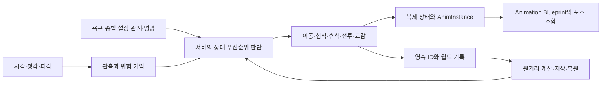
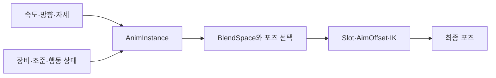

# 전체 구조

[문서 처음](../README.md) · [동물 AI](animal-ai.md) · [생태와 저장](ecology-and-persistence.md)

기준: 2026-09-20 개발본. Unreal Engine **5.7.4**, C++, Blueprint / Animation Blueprint, DataAsset, World Partition을 사용합니다. 엔진 버전은 실제 설치본의 `Build.version`으로 확인했습니다.

## 게임 상태와 표현의 연결

동물의 의사결정은 서버에서 감각 정보와 내부 상태를 읽어 수행합니다. 행동 상태가 이동과 상호작용을 결정하고, 복제된 상태와 AnimInstance가 화면의 포즈로 연결됩니다. 멀리 떨어진 개체의 상태는 데이터 기록으로 계산한 뒤 다시 Actor로 복원합니다.

## 책임을 나눈 위치

아래는 원본 개발 프로젝트의 파일·함수명입니다. 원본 게임 소스는 공개 문서 저장소에 포함하지 않습니다.

| 책임 | 근거 파일 | 핵심 진입점 |
|---|---|---|
| 동물 감각 입력 | `Source/NONGJANG/NNAnimalController.cpp` | `ANNAnimalController::OnPossess`, `Perceived` |
| 동물 행동 결정 | `Source/NONGJANG/NNAnimal.cpp` | `ANNAnimal::Think`, `SetAction`, `SearchForNeeds` |
| 종별 조정값 | `Source/NONGJANG/NNAnimal.h` | `UNNAnimalData`의 감각·전투·먹이·교감·훈련 설정 |
| 전투 단계 | `Source/NONGJANG/NNAnimalCombat.cpp` | `FNNAnimalCombatMemory::Started`, `Advance` |
| 경험 기억 | `Source/NONGJANG/NNWildlifeTypes.cpp` | `FNNAnimalExperience::Learn`, `Decay`, `RiskAt` |
| 원거리 상태 | `Source/NONGJANG/NNWorldEcology.cpp` | `UNNWorldLedger::AdvanceRemoteEcology` |
| Actor 전환 | `Source/NONGJANG/NNWorldPaging.cpp` | `SleepActor`, `WakeActor`, `ProcessPaging` |
| 저장 | `Source/NONGJANG/NNSaveGame.cpp` | `UNNSaveSubsystem::CaptureCurrentWorld`, `CommitWorld`, `LoadWorld` |
| 방문 흐름 | `Source/NONGJANG/NNVisitCoordinator.cpp` | `BeginVisit`, `Handshake`, `RequestReturn`, `HandleDisconnect` |

## 동물 AI와 애니메이션의 상태는 구분

동물 행동은 `ENNAnimalAction`과 전투 단계, 현재 목표·위험·욕구를 이용한 C++ 판단입니다. `ANNAnimalController`는 Unreal AI Perception의 시각·청각 정보를 동물에 전달합니다. 자체 동물 실행 경로에서 Behavior Tree나 StateTree 사용 근거는 확인하지 않았습니다.

애니메이션은 별도의 표현 계층입니다. `UNNAnimInstance::NativeUpdateAnimation`과 `UNNAnimalAnimInstance::NativeUpdateAnimation`이 이동 속도·방향, 자세·장비·행동 값을 공급합니다. 자체 ABP 작성 코드는 BlendSpace·Slot·BlendListByBool·AimOffset·IK를 조합합니다. 시각적인 Animation State Machine 노드를 작성한 사례로 소개하지 않습니다.

근거는 `Source/NONGJANG/NNAnimInstance.cpp`, `Source/NONGJANG/NNAnimal.cpp`, `Source/NONGJANGEditor/NNAnimationAssetLibrary.cpp`입니다. 에디터 도구의 `CreateAnimalBlueprint`, `CreateCombatBlueprint`, `CreateLocomotionBlueprint`, `ConnectAnimalDrinking`이 그래프와 자산 연결을 작성합니다.

노드 연결이나 입력값 검사 통과만으로 시각 품질을 완료 처리하지 않습니다. 걷기 전환, 발·무릎 접지, 의상·장비 관통, 수면·사망 접지, 총구 이펙트 정렬은 실제 장면 검수를 계속 진행합니다.

## 네트워크의 책임

동물 상태와 피해·상호작용은 서버 권한을 기준으로 연결합니다. 플레이어 이동은 Unreal CharacterMovement의 예측 기반을 사용하면서 `FNNSavedMove`에 달리기 상태와 속도 조건을 반영합니다. 근거는 `Source/NONGJANG/NNCharacter.cpp`의 `GetCompressedFlags`, `CanCombineWith`, `PrepMoveFor`, `UpdateFromCompressedFlags`, `GetPredictionData_Client`입니다.

이는 엔진 이동 예측을 프로젝트 상태에 맞게 확장한 작업입니다. 차량까지 포함한 모든 동작의 예측·서버 보정을 완성했다는 의미는 아닙니다. 실제 두 PC·Steam 두 계정·지연과 손실 조건의 검증은 [후속 범위](roadmap.md)에 남아 있습니다.
