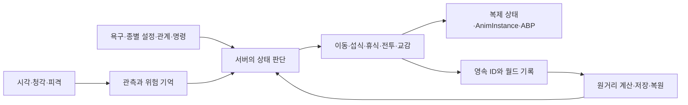

# 전체 구조

[문서 처음](../README.md) · [동물 AI](animal-ai.md) · [생태와 저장](ecology-and-persistence.md)

2026-10-01 기준 원본 프로젝트의 구조입니다. Unreal Engine 5.7.4, C++, Blueprint / Animation Blueprint, DataAsset, World Partition을 사용합니다. 엔진 버전은 설치본의 `Build.version`으로 확인했습니다.

## 행동 판단과 표현

동물은 서버에서 감각 정보와 욕구, 관계·명령·위험을 읽어 다음 행동을 정합니다. 행동 상태가 이동과 상호작용을 결정하고 복제 상태와 AnimInstance가 화면의 포즈를 조합합니다. 먼 개체는 기록으로 전환해 상태를 계산한 뒤 다시 Actor로 복원합니다.

| 책임 | 원본 파일 | 진입점 또는 역할 |
|---|---|---|
| 감각 입력 | `NNAnimalController.cpp` | AI Perception, `Perceived` |
| 행동 결정 | `NNAnimal.cpp`, `NNAnimal.h` | `Think`, `SetAction`, `SearchForNeeds`, `UNNAnimalData` |
| 전투 단계 | `NNAnimalCombat.cpp` | `FNNAnimalCombatMemory::Started`, `Advance` |
| 경험 기억 | `NNWildlifeTypes.cpp` | `FNNAnimalExperience::Learn`, `Decay`, `RiskAt` |
| 원거리 생태 | `NNWorldEcology.cpp` | `UNNWorldLedger::AdvanceRemoteEcology` |
| Actor 전환 | `NNWorldPaging.cpp` | `SleepActor`, `WakeActor`, `ProcessPaging` |
| 저장 | `NNSaveGame.cpp` | `CaptureCurrentWorld`, `CommitWorld`, `LoadWorld` |
| 다른 섬 방문 | `NNVisitCoordinator.cpp` | `BeginVisit`, `Handshake`, `RequestReturn`, `HandleDisconnect` |

위 파일은 원본의 `Source/NONGJANG/` 아래에 있습니다. 이 공개 저장소에는 설명만 제공합니다.

## 애니메이션 연결

동물 행동은 `ENNAnimalAction`과 전투 단계, 목표·위험·욕구를 이용한 C++ 우선순위 판단입니다. 자체 동물 실행 경로에서 Behavior Tree나 StateTree를 사용하는 근거는 확인하지 않았습니다.

애니메이션은 `UNNAnimInstance`와 `UNNAnimalAnimInstance`가 속도·방향·장비·행동 값을 공급합니다. Animation Blueprint는 BlendSpace, Slot, AimOffset, IK 등을 조합합니다. 에디터 도구 `NNAnimationAssetLibrary.cpp`가 그래프와 자산 연결을 작성합니다.

9월 말에는 양손 파지와 이동 방향·보폭 보정을 추가했습니다. `NNTwoHandTool`, `NNOrientationWarp`, `NNStrideWarp`는 각각 손 접촉, 하체 회전, 보폭과 대기 발 간격을 다룹니다. 권총·소총은 `NNFirearmAnim.cpp`에서 무기별 목표를 계산합니다. 실제 화면에서 파지와 일부 전환을 확인했으며 모든 외형·착장·경사 검수는 진행 중입니다.

## 데이터와 월드 작업

종별 감각·먹이·전투·교감 설정은 `UNNAnimalData`, 캐릭터 특성은 `NNCharacterTraits`, 총기·탄약·제작 규칙은 `NNFirearmData`에 나눠 둡니다. 캐릭터 특성의 배정과 배율은 설정으로 바꾸며 일부 배정은 초기 조정안입니다.

월드는 World Partition과 지형·식생 저작 도구로 작업합니다. 저장 전에는 지형·수면·뿌리 지지·자원 접근을 검사하고 저장 후 같은 시점에서 실제 화면을 비교합니다. 숲·습지·정글·해안·동굴의 후보가 모두 채택된 것은 아니며 [남은 작업](roadmap.md)에서 최종 경관과 이동 검수를 추적합니다.

## 네트워크와 확장 범위

동물 상태와 피해·상호작용은 서버 권한을 기준으로 처리합니다. 플레이어 이동은 Unreal CharacterMovement의 예측을 사용하고 `FNNSavedMove`에 달리기 상태와 속도 조건을 반영합니다. 근거는 `NNCharacter.cpp`의 `GetCompressedFlags`, `CanCombineWith`, `PrepMoveFor`, `UpdateFromCompressedFlags`, `GetPredictionData_Client`입니다.

정식판의 최대 2인 방문·귀환은 저장 기록과 인벤토리 잠금을 함께 다룹니다. 같은 PC의 LAN 시나리오를 확인했으며 실제 두 PC·Steam 계정, 지연·손실과 차량 동기화는 추가 검수가 필요합니다.

`NNContentPack`에는 기본팩과 좀비 확장팩을 나누는 모드·권한 판정 구조가 있습니다. 좀비 AI·웨이브, 모드 선택 화면과 Steam DLC 소유권 연결은 후속 작업입니다. [데모 제한](release-plan.md)도 별도 설계 단계로 남아 있습니다.
